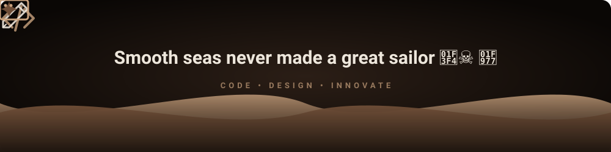

<!-- ══════════════════════════════════════════════════════════════════ -->
<!--                   GEDEON KOH — PROFILE README v4                  -->
<!-- ══════════════════════════════════════════════════════════════════ -->

<!--
  Coffee Palette
  Espresso  #2B1E16  |  Mocha  #6F4E37  |  Caramel #A67B5B
  Latte     #C9A27E  |  Cream  #EDE6DB  |  Accent  #9C6B4E
-->

<!-- ═══ ORIGINAL BANNER ═══ -->

  

<!-- ═══ TYPING ANIMATION ═══ -->

  

 

<!-- ═══ INTRO CARD ═══ -->

  <table width="860" cellpadding="0" cellspacing="0">
    <tr>
      <td width="58%" valign="top" bgcolor="#EDE6DB" style="padding:28px 26px; border-radius:18px;">
         
        <strong>Crafting systems at the edge of AI, hardware, and human-centered design.</strong>  
        Building playful, purposeful tech — from embedded gadgets 🤖 to intelligent software 💡. Making the world a better place once and for all 🌎. Always shipping, always learning.  
        </a>
        
      </td>
      <td width="2%" bgcolor="#EDE6DB">&nbsp;</td>
      <td width="40%" valign="top" align="center" bgcolor="#EDE6DB" style="padding:24px 20px; border-radius:18px; border-left:2px dashed #A67B5B;">
         
        <small><i>Presenting My Project at the Annual GT College International Science Project Competition (GTC-ISPC) 2025</i></small>
      </td>
    </tr>
  </table>

 

<!-- ═══ QUICK LINKS ═══ -->

&nbsp;
&nbsp;
&nbsp;

---

## 🌐 Social Profiles

&nbsp;&nbsp;
&nbsp;&nbsp;
&nbsp;&nbsp;
&nbsp;&nbsp;
&nbsp;&nbsp;

---

<!-- ═══ FOOTER WAVE ═══ -->

  

